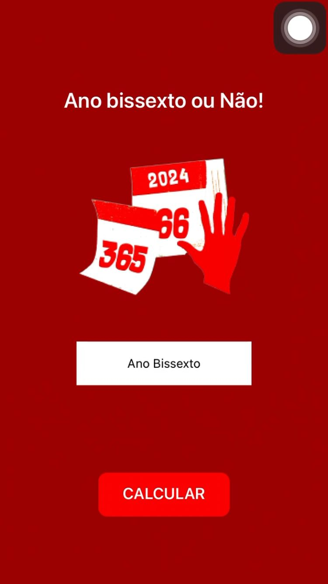

# Aplicativo de calculadora de ano bissexto

## Visão geral

O aplicativo Leap Year Calculator é um aplicativo simples e fácil de usar desenvolvido usando o MIT App Inventor. Este aplicativo permite aos usuários verificar se um determinado ano é bissexto. Os anos bissextos são importantes para manter o nosso ano civil sincronizado com o ano astronômico. Um ano bissexto tem 366 dias em vez dos habituais 365 dias, com um dia extra adicionado ao mês de fevereiro.

## Características

- **Entrada do usuário**: os usuários podem inserir qualquer ano para verificar se é um ano bissexto.
- **Resultado Instantâneo**: O aplicativo informa instantaneamente ao usuário se o ano inserido é bissexto ou não.
- **Interface Simples**: Interface fácil de usar, adequada para todas as faixas etárias.

## Ferramentas de desenvolvimento

- **MIT App Inventor**: um ambiente de desenvolvimento integrado baseado na Web para a criação de aplicativos Android.
- **Componentes usados**:
   - TextBox: Para entrada do usuário.
   - Botão: Para acionar o cálculo.
   - Etiqueta: Para exibir o resultado.

## Como usar

1. Abra o aplicativo Calculadora de ano bissexto em seu dispositivo Android.
2. Insira um ano no campo de entrada.
3. Pressione o botão "Verificar ano bissexto".
4. O resultado será exibido, indicando se o ano informado é bissexto ou não.

## Lógica por trás do cálculo do ano bissexto

O algoritmo para determinar se um ano é bissexto segue estas regras:

- Um ano é bissexto se for divisível por 4;
- No entanto, se o ano for divisível por 100, não é um ano bissexto, a menos que;
- O ano também é divisível por 400, caso em que é um ano bissexto.

## Capturas de tela do aplicativo

  
  

## Instalação

1. Baixe o arquivo APK do aplicativo Leap Year Calculator.
2. Transfira o arquivo APK para o seu dispositivo Android.
3. Abra o arquivo APK e siga as instruções na tela para instalar o aplicativo.

## Melhorias Futuras

- **Cálculos de data estendida**: adicione funcionalidade para calcular o número de anos bissextos entre dois anos determinados.
- **Dados históricos**: Forneça fatos históricos sobre anos bissextos.
- **Suporte multilíngue**: suporte para vários idiomas para atingir um público mais amplo.

## Licença

Este projeto está licenciado sob a licença MIT - consulte o arquivo [LICENSE](LICENSE) para obter detalhes.

## Reconhecimentos

- Obrigado aos desenvolvedores do MIT App Inventor por fornecerem uma plataforma fácil para desenvolver aplicativos Android.
- Inspiração de vários tutoriais online e documentação sobre cálculos de anos bissextos.

## Contato

Para qualquer dúvida ou sugestão, entre em contato:

- **E-mail**: gustavorodrigues11cr@gmail.com
- **GitHub**: [gustavosousa7]((https://github.com/gustavosousa07))

---

Obrigado por usar o aplicativo Calculadora de ano bissexto! Seu feedback é valioso para nós.

